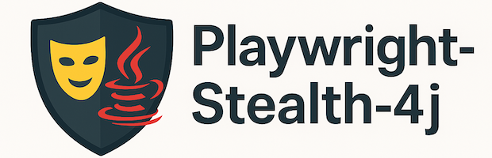
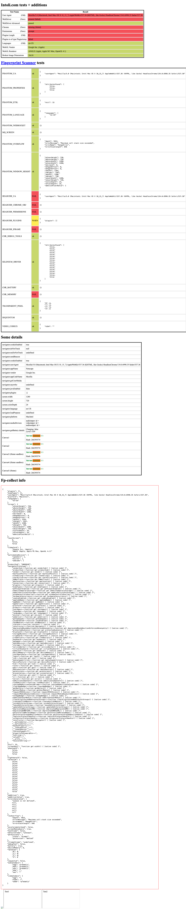
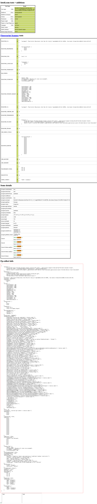

<h1 align="center">
    
</h1>


Playwright-Stealth for JVM is a Kotlin-based library that helps bypass bot detection mechanisms by applying various evasions to Playwright’s BrowserContext and/or Pages. Designed for seamless integration with Java, Kotlin, and Groovy, this library provides an intuitive API to enhance browser automation stealthiness.

JVM Porting of https://github.com/AtuboDad/playwright_stealth

## Features

- ✅ Stealth Enhancements – Modify navigator properties, WebGL fingerprints, and more.
- ✅ JVM Compatibility – Usable in any JVM-based project.
- ✅ Easy API – Simple integration methods.
- ✅ Customizable Configurations – Enable or disable specific evasions as needed.

## Installation

Playwright-Stealth for JVM is distributed via [Maven Central](https://central.sonatype.com/artifact/io.github.kihdev/playwright-stealth-4j). You can add it to your project using Gradle or Maven.

Add the dependency to your `build.gradle.kts`:

```kotlin
dependencies {
    implementation("io.github.kihdev:playwright-stealth-4j:1.1.2")
}
```

or to your `pom.xml`:

```xml
<dependency>
    <groupId>io.github.kihdev</groupId>
    <artifactId>playwright-stealth-4j</artifactId>
    <version>1.1.2</version>
</dependency>
```

## Usage

From Kotlin, handy extension functions `stealth()` are provided to `BrowserContext` and `Page` classes.

```kotlin
import com.microsoft.playwright.*
import io.github.kihdev.playwright.stealth4j.Stealth4j

fun stealth() {
    Playwright.create().use { playwright ->
        val chromium = playwright.chromium()
        chromium.launch().use { browser ->
            val context = browser.newContext().stealth()
            val page = context.newPage()
            page.navigate("https://bot.sannysoft.com/")

            page.screenshot(
                Page.ScreenshotOptions()
                    .setPath(Paths.get("build/tmp/screenshots/stealth.png"))
                    .setFullPage(true)
            )
        }
    }
}
```

From Java, you can use the `Stealth4j` class to apply stealth features to your `BrowserContext` or `Page`.

```java
import com.microsoft.playwright.*;
import io.github.kihdev.playwright.stealth4j.Stealth4j;

public static void main(String[] args) {
    try (Playwright playwright = Playwright.create()) {
        Browser browser = playwright.chromium().launch();
        var stealthContext = Stealth4j.newStealthContext(browser);
        Page page = stealthContext.newPage();
        page.navigate("https://bot.sannysoft.com/");
        page.screenshot(
                new Page.ScreenshotOptions()
                        .setPath(Paths.get("build/tmp/screenshots/stealth.png"))
                        .setFullPage(true)
        );
    }
}
```

## Test Results
From [bot.sannysoft.com](https://bot.sannysoft.com/)
|   Headless   | With stealth |
|--------------|--------------|
|  |  |

## Contributing

Contributions are welcome! Feel free to open an issue or submit a pull request.
